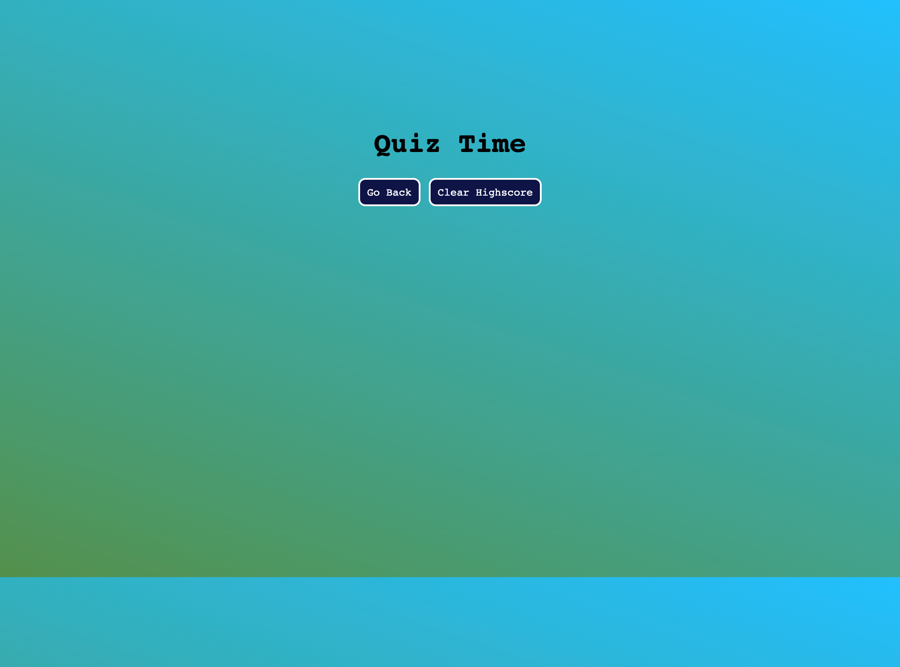

# Code Quiz
>### Module 4 UNC Coding Bootcamp Challenge - Web APIs Challenge   
>  Test your knowledge of basic HTML, CSS, and JavaScript by taking my multiple choice, time-sensitive quiz! Once you start the quiz, you have 75 seconds to complete the questions. Your score depends on how quickly you answer the questions, and a time penalty is issued when questions are answered incorrectly. Once you have completed the quiz, type your initials into the submission box and watch your score appear on the leaderboard via the HighScore page.

> This project incorporates a variety of full-stack development techniques. HTML and CSS are utilized to structure and give aesthetics to the front-end of the web application, while JavaScript and web API's are used to alter the original HTML text, as well as collect and append user-collected data to the web page.   

![JavaScript][js-url]
![HTML][html-url]
![CSS][css-url]

## Usage

Click `Start Quiz` on the main page to begin the quiz. Select your answer choices and press `Next Question` to continue. Once you are finished, enter your initials into the box to be added to the leaderboard.

## Deployed Application
You can view the live application
[here]()

Distributed under the MIT license. See ``LICENSE`` for more information.

